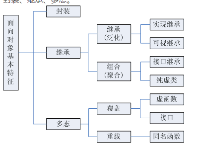
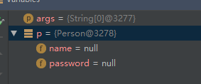

# 面向对象的特征
封装：
抽象：
继承：
多态：

## 封装：
一个类就是一个封装，过

~~~
package  com.dingyi.tai.demo1.hello;
class Person{

    String name;
    String password;

    public String getName() {
        return name;
    }

    public void setName(String name) {
        this.name = name;
    }

    public String getPassword() {
        return password;
    }

    public void setPassword(String password) {
        this.password = password;
    }

}
~~~

##  继承：